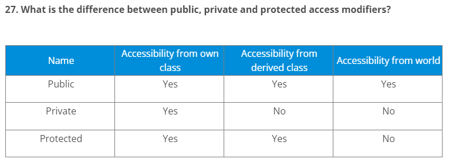
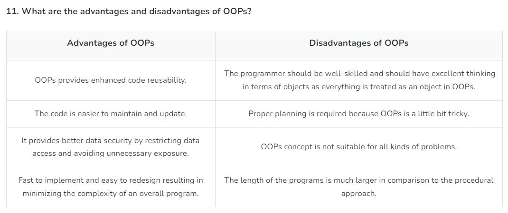

> # Some OOP Related Interview Questions

# What are the various types of constructors in C++?

1. Default constructor: The default constructor is the constructor which doesn’t take any argument. It has no parameters.
2. Parameterized constructor: The constructors that take some arguments are known as parameterized constructors.
3. Copy constructor: A copy constructor is a member function that initializes an object using another object of the same class.

# Types of constructors

Types of constructors differ from language to language.

- Default constructor
- Parameterized constructor
- Non-Parameterized constructor
- Copy constructor

# Are class and structure the same? If not, what's the difference between a class and a structure?

No, class and structure are not the same. Though they appear to be similar, they have differences that make them apart. For example, the structure is saved in the stack memory, whereas the class is saved in the heap memory. Also, Data Abstraction cannot be achieved with the help of structure, but with class, Abstraction is majorly used.

# What is meant by static polymorphism?

Static Polymorphism is commonly known as the Compile time polymorphism. Static polymorphism is the feature by which an object is linked with the respective function or operator based on the values during the compile time. Static or Compile time Polymorphism can be achieved through Method overloading or operator overloading.

# What is meant by dynamic polymorphism?

Dynamic Polymorphism or Runtime polymorphism refers to the type of Polymorphism in OOPs, by which the actual implementation of the function is decided during the runtime or execution. The dynamic or runtime polymorphism can be achieved with the help of method overriding.

# What is the difference between a class and a structure?

Class: User-defined blueprint from which objects are created. It consists of methods or set of instructions that are to be performed on the objects.
Structure: A structure is basically a user-defined collection of variables which are of different data types.

# What are virtual functions?

Virtual functions are functions that are present in the parent class and are overridden by the subclass. These functions are used to achieve runtime polymorphism.

# What is Garbage Collection(GC)?

GC is an implementation of automatic memory management. The Garbage collector frees up space occupied by objects that are no longer in existence.

# Why OOPs?

The main advantage of OOP is better manageable code that covers the following:

- The overall understanding of the software is increased as the distance between the language spoken by developers and that spoken by users.
- Object orientation eases maintenance by the use of encapsulation. One can easily change the underlying representation by keeping the methods the same.
- The OOPs paradigm is mainly useful for relatively big software.

# What are the limitations of OOPs?

- Usually not suitable for small problems
- Requires intensive testing
- Takes more time to solve the problem
- Requires proper planning
- The programmer should think of solving a problem in terms of objects

#

# What are manipulators?

Manipulators are the functions which can be used in conjunction with the insertion (<<) and extraction (>>) operators on an object. Examples are endl and setw.

# What is an interface?

A unique class type known as an interface contains methods but not their definitions. Inside an interface, only method declaration is permitted. You cannot make objects using an interface. Instead, you must put that interface into use and specify the procedures for doing so.

# What is the super keyword?

The super keyword is used to invoke the overridden method, which overrides one of its superclass methods. This keyword allows to access overridden methods and also to access hidden members of the superclass.

# What are sealed modifiers?

Sealed modifiers are the access modifiers where the methods can not inherit it. Sealed modifiers can also be applied to properties, events, and methods. This modifier cannot be used to static members.

# What is ‘this’ pointer?

THIS pointer refers to the current object of a class. THIS keyword is used as a pointer which differentiates between the current object with the global object. It refers to the current object.

# What is a copy constructor?

This is a special constructor for creating a new object as a copy of an existing object. There will always be only one copy constructor that can be either defined by the user or the system.
